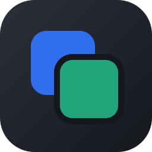
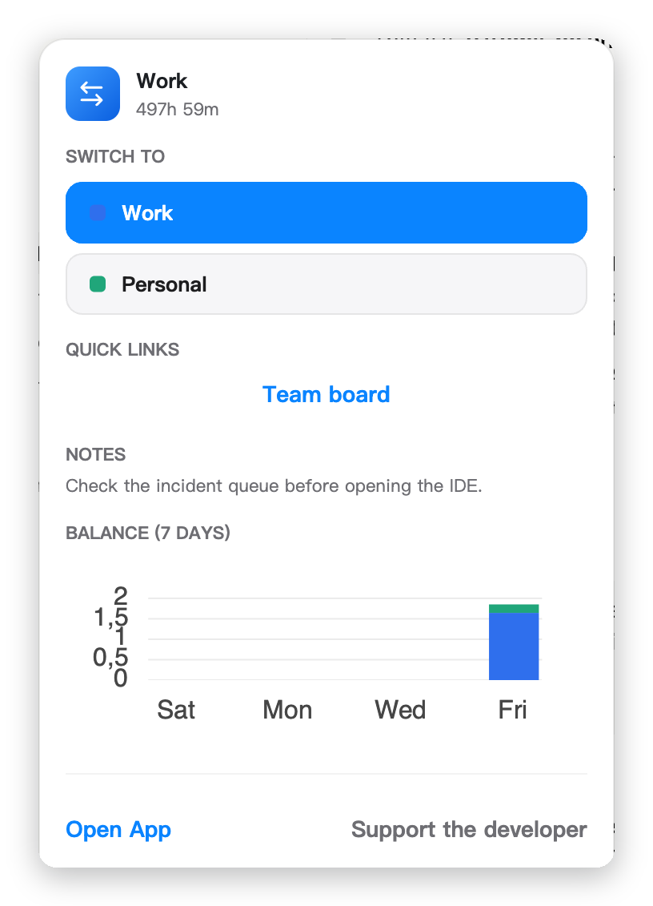
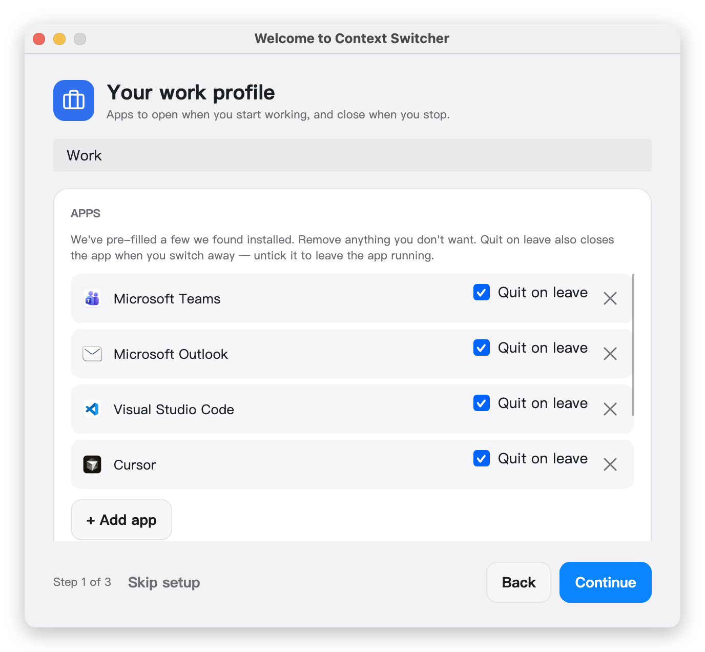
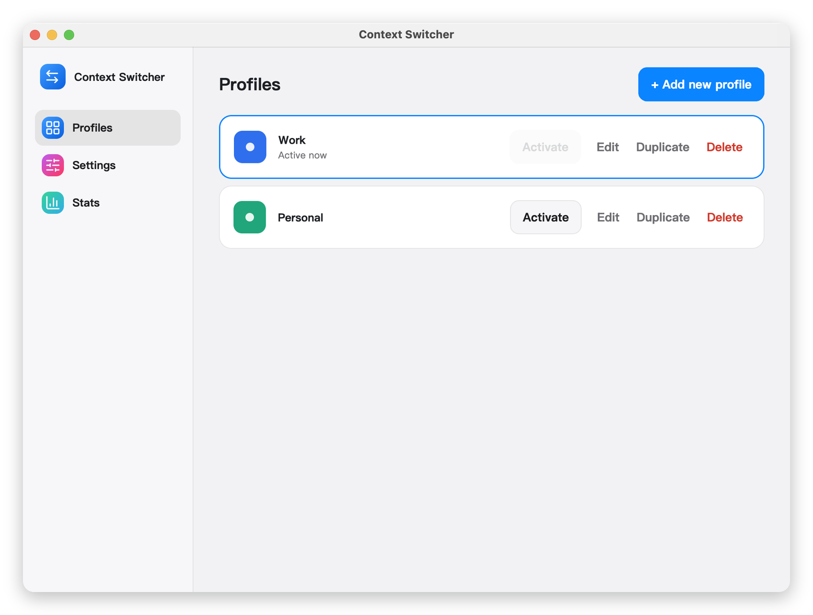
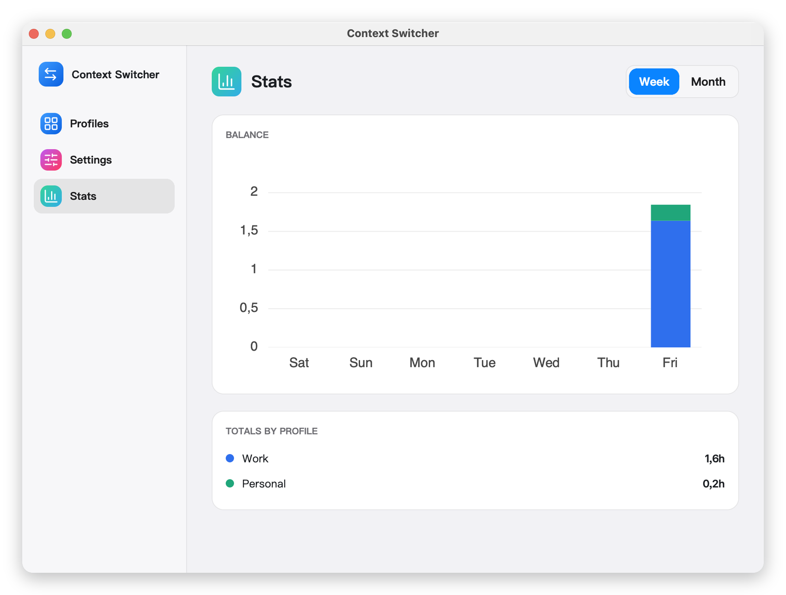
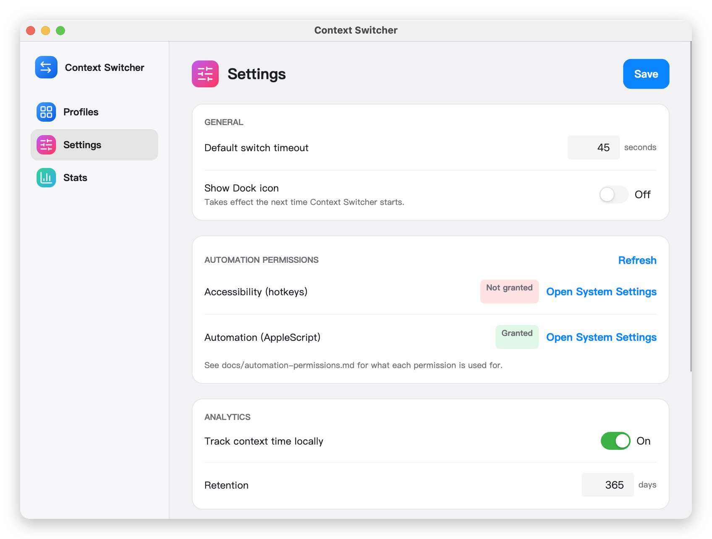

<div align="center">



# ContextSwitcher

**One click flips your Mac between work and personal.**

Opens the apps you need, closes the ones you don't, and keeps the two from bleeding into each other.




</div>

---

## What it does

You finish work. Slack is still pinging, your IDE is still open, four work tabs are still loaded, and
Do Not Disturb is still on from this morning. Switching context by hand takes five minutes and you
never do all of it.

ContextSwitcher does it in one click. You define a **profile** — a set of apps to open, apps to quit,
browser tabs, a theme, a wallpaper, a Focus mode, Docker containers — and switching to that profile
applies all of it.

- **Launch and quit apps** — graceful `Cmd+Q`-style quits, never force-kills
- **Browser tabs** — open URLs, activate tab groups, or launch a whole Chrome/Brave profile
- **Appearance** — light/dark theme and wallpaper per profile
- **Focus mode** — via a Shortcut you create, since macOS has no Focus scripting API
- **Docker** — start the containers this context needs, stop the ones it doesn't
- **Media** — start an Apple Music or Spotify playlist
- **Global hotkeys** — bind a key to each profile
- **Time tracking** — see the work/personal balance of your week, stored only on your Mac

Everything is optional. A profile that only opens two apps is a perfectly good profile.

## Install

> **Prebuilt downloads aren't published yet.** The release workflow is still being built, so today
> the way to run it is from source. The download instructions below are what they'll be, and are kept
> here so the process is documented in one place.

### From source

```bash
git clone https://github.com/ArtemkaGoldMan/ContextSwitcher.git
cd ContextSwitcher
dotnet run --project src/ContextSwitcher.App/ContextSwitcher.App.csproj
```

Requires the [.NET 10 SDK](https://dotnet.microsoft.com/download). The app lives in the menu bar —
look for the two-squares icon rather than a Dock icon or a window.

To build a real `.app` and a `.dmg` instead of running from the project:

```bash
./scripts/build-dmg.sh      # dist/ContextSwitcher-0.1.0.dmg
```

### From a release

Download the `.dmg` from [Releases](https://github.com/ArtemkaGoldMan/ContextSwitcher/releases) and
drag the app to `/Applications`.

ContextSwitcher is **not notarised by Apple** — that needs a paid Developer ID, and this is a free
MIT project. macOS will therefore refuse to open it on first launch. Clear the quarantine flag:

```bash
xattr -d com.apple.quarantine /Applications/ContextSwitcher.app
```

Or open it once via **System Settings → Privacy & Security → Open Anyway**. You only need to do this
once per install.

## First run

A short wizard sets up two profiles and switches you into the first one, so you see the app do its
job immediately. App suggestions are pre-filled from what's actually installed on your Mac.

<div align="center">

</div>

Each app has a **Quit on leave** toggle. Leave it on and the app closes when you switch away; untick
it to keep the app running. You can change all of this later.

## Using it

Click the menu bar icon to switch, or press the hotkey you assigned. From the popover you can reach
the main window, where profiles are created and edited.

<div align="center">

</div>

<div align="center">

</div>

## Permissions

macOS gates the things ContextSwitcher does. It asks for the minimum, and every switch works without
any of them — you just get warnings for the parts that need one.

| Permission | Needed for | If you skip it |
| --- | --- | --- |
| **Automation** | Quitting apps, tabs, theme, wallpaper, media | Those steps report a warning |
| **Accessibility** | Global hotkeys only | Hotkeys silently never fire |

Settings shows the live status of both, with a button that opens the right pane. See
[docs/automation-permissions.md](docs/automation-permissions.md).

<div align="center">

</div>

> **Known limitation.** Because the app isn't signed with an Apple Developer ID, macOS ties the
> Accessibility grant to the exact build. **After updating, you'll need to grant it again** or
> hotkeys stop working. Settings will show it as "Not granted" when this happens.

## Command line

Every switch is scriptable, which is how the macOS Shortcuts and Siri integration works.

```bash
ContextSwitcher switch --context work      # switch profile
ContextSwitcher switch --context work --dry-run   # show the steps, change nothing
ContextSwitcher status                     # what's active now
ContextSwitcher list-contexts              # every configured profile
ContextSwitcher validate-config            # check settings.json
```

Add `--json` to any of them for machine-readable output.

| Exit code | Meaning |
| --- | --- |
| `0` | Success |
| `1` | General failure |
| `2` | Invalid arguments |
| `3` | Unknown context |
| `4` | Configuration invalid |
| `5` | Succeeded with warnings |
| `6` | Another switch is already running |

See [docs/shortcuts-integration.md](docs/shortcuts-integration.md) for Siri and Shortcuts setup.

## Configuration

Profiles live in `~/.config/ContextSwitcher/settings.json`. Everything in the UI writes to that file,
and you can edit it directly if you prefer.

```json
{
  "id": "work",
  "displayName": "Work",
  "menuBarLabel": "WORK",
  "accentColor": "#2F6FED",
  "launchApps": ["Slack", "Visual Studio Code"],
  "closeApps": ["Slack", "Visual Studio Code"],
  "browser_management": {
    "mode": "urls",
    "browser": "Chrome",
    "urls": ["https://mail.google.com/", "https://github.com/notifications"],
    "avoid_duplicate_tabs": true
  },
  "theme": { "mode": "light" },
  "focus": { "enabled": true, "modeName": "Work" }
}
```

`closeApps` lists what to quit **when you leave** this profile — see
[docs/configuration.md](docs/configuration.md) for the full schema and why it works that way.

## Privacy

Everything stays on your Mac. There is no account, no telemetry, and no network call of any kind.

- Time tracking is written to `~/.config/ContextSwitcher/analytics.jsonl` and never leaves the machine
- The app never reads your browsing history — it only compares the startup URLs you configured
- Logs contain app names and profile ids, never file contents or page contents
- Every external command is checked against an allowlist before it runs

## Building and contributing

```bash
dotnet build            # build
dotnet test             # 166 tests
./scripts/build-icons.sh   # regenerate the app icon (needs librsvg)
```

The architecture, config schema and macOS command templates are specified in
[agent.md](agent.md) — start there before changing behaviour.

## Documentation

| | |
| --- | --- |
| [Configuration](docs/configuration.md) | Full `settings.json` schema with examples |
| [Automation permissions](docs/automation-permissions.md) | What macOS asks for and why |
| [Shortcuts and Siri](docs/shortcuts-integration.md) | Focus modes, voice control, CLI triggers |
| [Release process](docs/release-process.md) | Tagging, packaging, publishing |

## Support

The app is free and always will be — every feature, no license, nothing gated. If it ever saves you
time and you feel like it, there'll be a "buy me a beer" link here. That's the whole business model:
no subscriptions, no paid tier, nothing behind a key.

## License

[MIT](LICENSE). Icons from [Lucide](https://lucide.dev) (ISC) — see
[THIRD-PARTY-NOTICES.md](THIRD-PARTY-NOTICES.md).
