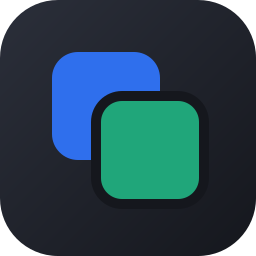
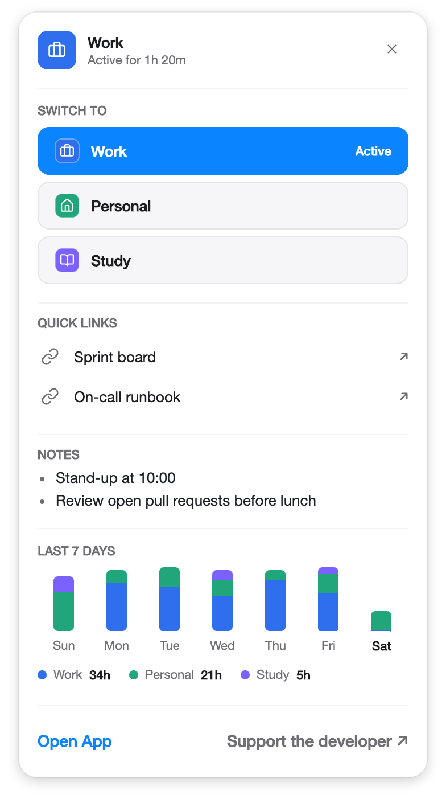
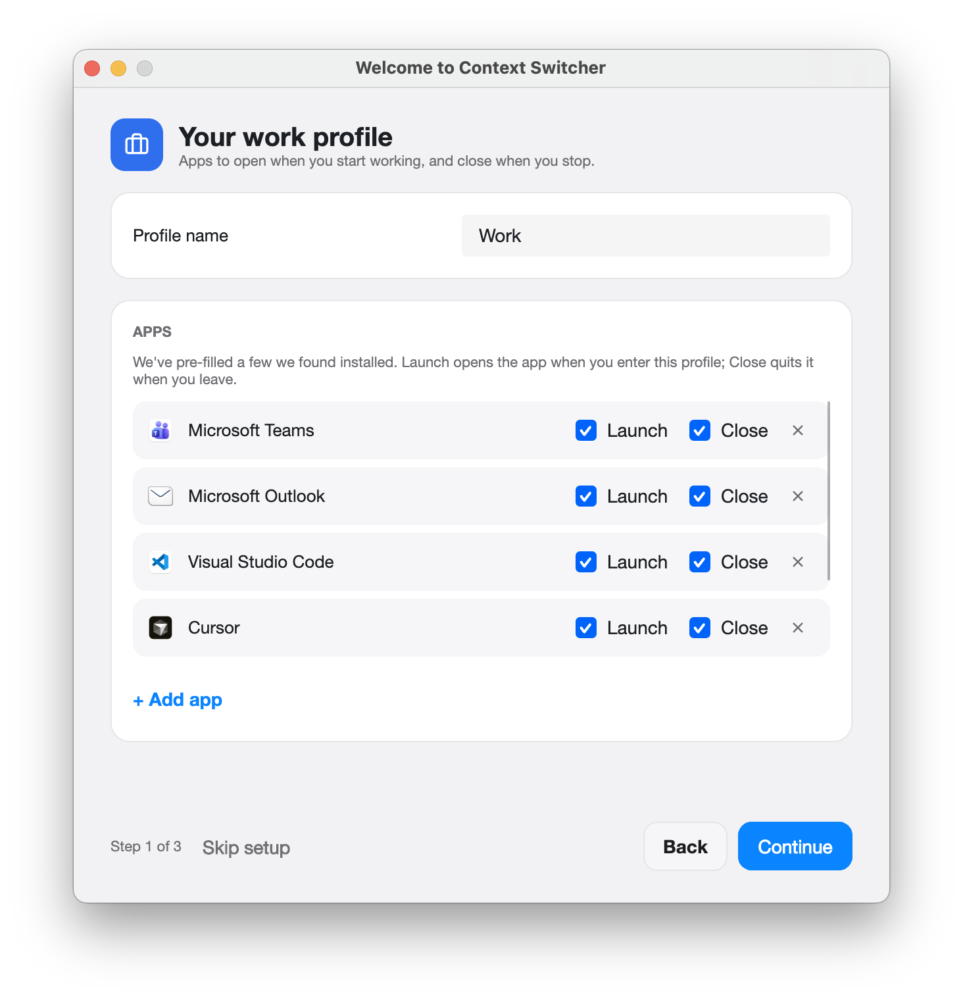
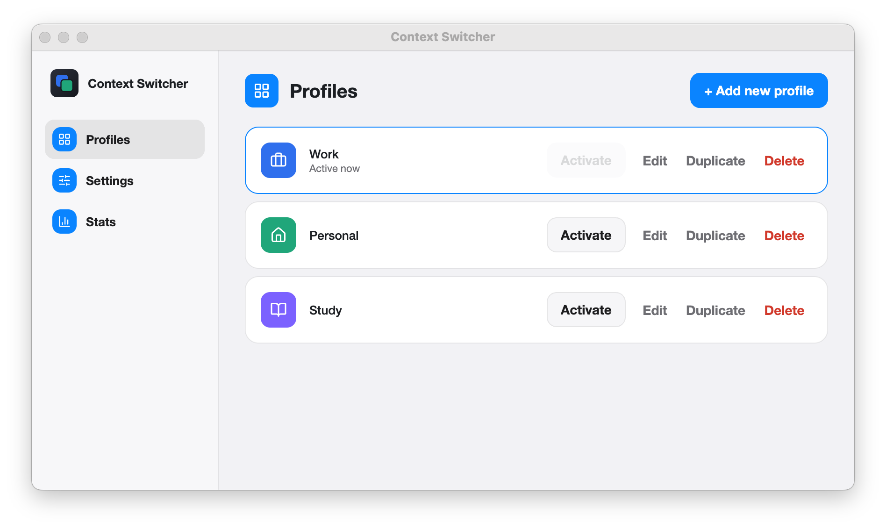
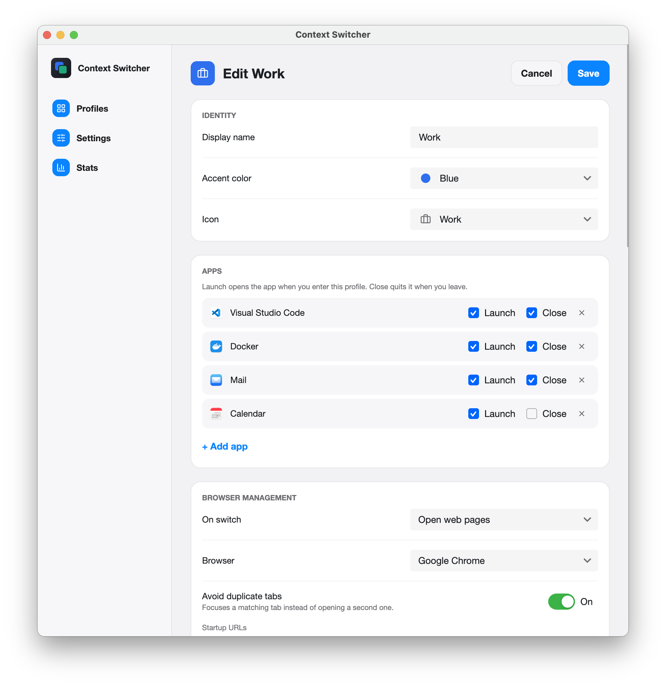
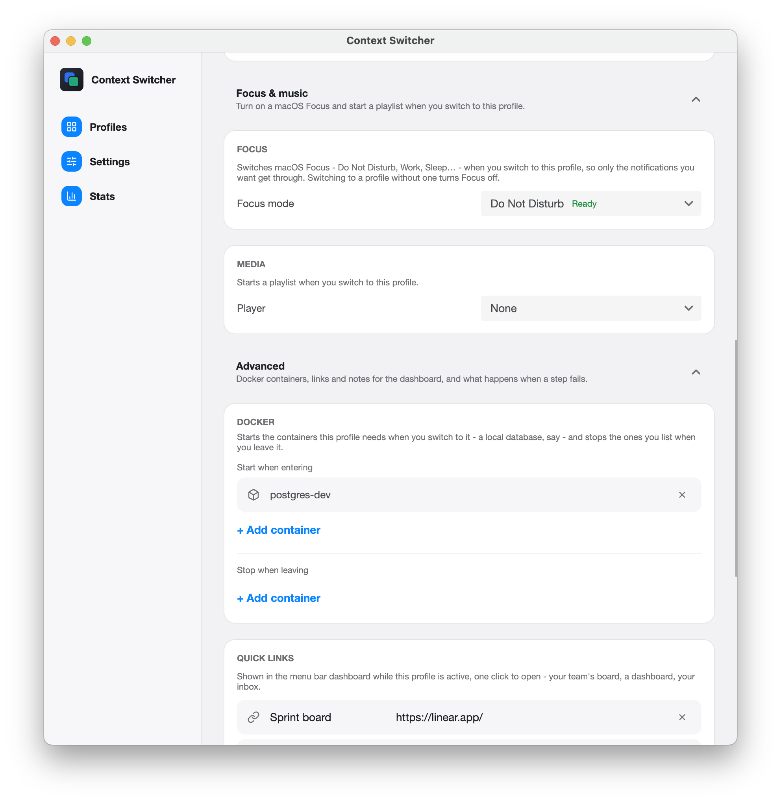
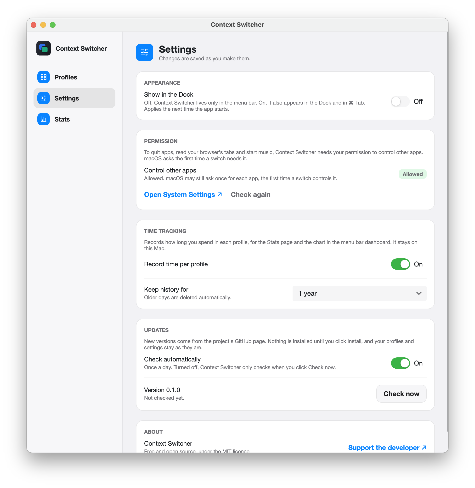
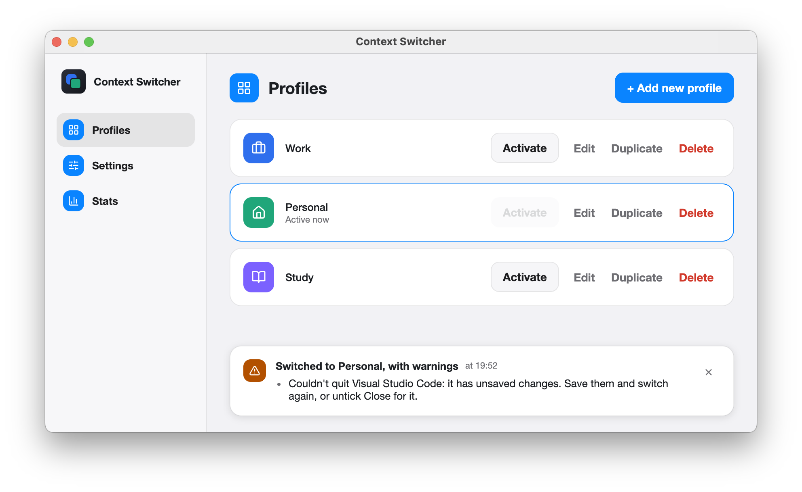
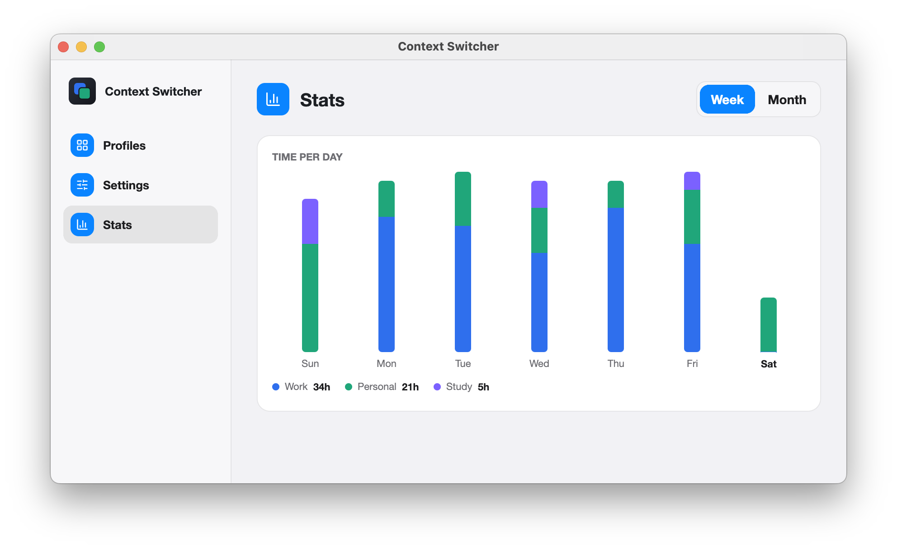

<div align="center">



# ContextSwitcher

**Switch your Mac between work and personal in one click.**

It opens the apps you need, quits the ones you don't, opens your tabs, turns on Focus and starts
your music — all from the menu bar.

[](https://github.com/ArtemkaGoldMan/ContextSwitcher/releases/latest)


<picture>
  <source media="(prefers-color-scheme: dark)" srcset="docs/images/dashboard-dark.png">
  
</picture>

[Install](#install) · [Getting started](#getting-started) · [Updates](#updates) · [FAQ](#faq)

</div>

---

## Why

You finish work. Slack is still pinging, your editor is still open, a dozen work tabs are still
loaded and Do Not Disturb is still on from the morning. Switching by hand takes five minutes, so
you never do all of it — and work follows you into the evening.

ContextSwitcher keeps a **profile** for each part of your day. Click one, and your Mac turns into it:

| | What a profile can do |
| --- | --- |
| **Apps** | Open apps when you switch in, and quit them when you switch out — the polite way, like ⌘Q, never force-quit |
| **Browser** | Open web pages, Chrome tab groups or a whole browser profile, without duplicating tabs that are already open |
| **Focus** | Turn on a macOS Focus — Do Not Disturb, Work, Sleep… — and turn it off again when you leave |
| **Music** | Start an Apple Music or Spotify playlist |
| **Docker** | Start the containers this profile needs, stop the ones it doesn't |
| **Dashboard** | Keep a few links and notes for this profile one click away |
| **Time** | See how your week splits between work and the rest of your life, stored only on your Mac |

Every part is optional. A profile that only opens two apps is a perfectly good profile.

## Install

You need a Mac with **Apple silicon** (M1 or later) and **macOS 13 Ventura or later**.

### Option 1 — one command (recommended)

Open **Terminal** (press ⌘Space, type *Terminal*, press Return), paste this and press Return:

```bash
curl -fsSL https://raw.githubusercontent.com/ArtemkaGoldMan/ContextSwitcher/main/install.sh | bash
```

It downloads the latest version, checks it isn't damaged, puts it in Applications and opens it.
Nothing else to do: macOS doesn't ask you to approve it.

### Option 2 — Homebrew

If you use [Homebrew](https://brew.sh):

```bash
brew install --cask artemkagoldman/tap/contextswitcher
```

### Option 3 — download it yourself

1. Download **ContextSwitcher-x.y.z.dmg** from the [latest release](https://github.com/ArtemkaGoldMan/ContextSwitcher/releases/latest).
2. Open it and drag **ContextSwitcher** onto **Applications**.
3. Allow it to open — once. macOS will say *"Apple could not verify ContextSwitcher is free of
   malware"*. Either paste this into Terminal:

   ```bash
   xattr -dr com.apple.quarantine /Applications/ContextSwitcher.app
   ```

   or try to open the app, click **Done**, then go to **System Settings → Privacy & Security**,
   scroll down to *"ContextSwitcher was blocked"* and click **Open Anyway**.

<details>
<summary><b>Why does macOS block it, and is that command safe?</b></summary>

<br>

macOS only opens downloaded apps without asking if the developer has paid Apple for a Developer
ID ($99 a year) and had the app *notarised*. ContextSwitcher is a free hobby project, so it isn't.

The command doesn't change any security settings. It removes the *"downloaded from the internet"*
label from this one app, which has the same effect as **Open Anyway**. Options 1 and 2 take care of
that label for you, so they skip this step.

What you install is built by GitHub from the public source code in this repository, and every
release is signed with the project's own certificate. The app checks that signature before it
installs any update.

</details>

## Getting started

### 1. A short setup

The first time it opens, a three-step wizard creates a **Work** and a **Personal** profile. It
suggests apps you actually have installed: tick **Launch** to open an app when you switch to that
profile, and **Close** to quit it when you switch away. You can change everything later.

<div align="center">

</div>

### 2. Switch from the menu bar

ContextSwitcher lives in the **menu bar** — look for the icon of two overlapping squares. It has no
Dock icon (you can turn one on in Settings).

- **Click the icon** and pick a profile to switch to it.
- **Open Dashboard** shows the active profile, how long you've been in it, its quick links and notes,
  and the last seven days. Click anywhere else to close it.
- **Open App** opens the main window, where you set profiles up.

### 3. Set up your profiles

The **Profiles** page lists every profile: **Activate** switches to it, **Edit** changes what it does.

<div align="center">
<picture>
  <source media="(prefers-color-scheme: dark)" srcset="docs/images/profiles-dark.png">
  
</picture>
</div>

Editing a profile is mostly picking from lists: apps from the apps you have installed, web pages
from the tabs you have open, playlists from your library, containers from Docker.

<div align="center">

</div>

### 4. Turn on Focus (optional)

macOS doesn't let other apps change Focus directly — only the **Shortcuts** app can. So for each
Focus you use, ContextSwitcher needs two small shortcuts: one that turns it on and one that turns it
off. You don't build them yourself:

1. In **Focus & music**, choose a **Focus mode**.
2. Click **Create it**. Shortcuts opens and asks to **Add Shortcut** — click it. The mode now shows
   **Ready**.
3. If a second **Create it** appears — for the shortcut that turns Focus off — do the same.

<div align="center">

</div>

A Focus you created yourself needs the two shortcuts made by hand — see
[Focus and Siri](docs/shortcuts-integration.md).

### 5. Allow ContextSwitcher to control other apps

The first time a switch quits an app, reads your browser's tabs or starts music, macOS asks whether
ContextSwitcher may control that app. Click **OK**. **Settings → Permission** shows whether it's
allowed and opens the right page in System Settings if it isn't. More in
[Permissions](docs/automation-permissions.md).

### 6. Make it yours

**Settings** has the rest: a light or dark **Theme** (or *Match macOS*, the default), whether the
app shows in the Dock, how long to keep your history, and updates.

<div align="center">
<picture>
  <source media="(prefers-color-scheme: dark)" srcset="docs/images/settings-dark.png">
  
</picture>
</div>

### When something doesn't go to plan

One step going wrong doesn't stop the rest of the switch. If an app refused to quit (it had unsaved
work, say) or a shortcut is missing, a card at the bottom of the Profiles page says what happened
and how to fix it. It stays until you close it or switch again.

<div align="center">

</div>

### See where your time goes

**Stats** shows how long you spent in each profile, per day, for the last week or month. It's
recorded only on your Mac and you can turn it off in Settings.

<div align="center">

</div>

## Updates

ContextSwitcher checks for a new version once a day. When there is one, **Update to x.y.z…**
appears in the menu bar menu and in **Settings → Updates**. Click **Install and restart**: it
downloads the new version, checks it is signed with the same certificate as the one you have, and
restarts into it.

- Your profiles, settings and history are kept.
- You don't need the Terminal command again, and macOS doesn't ask for permissions again.
- Prefer to check yourself? Turn off **Check automatically** and use **Check now**.

Running the one-command install again also updates, and so does `brew upgrade --greedy` if you
installed with Homebrew.

## Uninstall

1. Click the menu bar icon → **Quit**.
2. Drag **ContextSwitcher** from Applications to the Bin — or `brew uninstall --cask contextswitcher`.
3. To remove your profiles and history too:

   ```bash
   rm -rf ~/.config/ContextSwitcher
   ```

4. If you created Focus shortcuts, delete the ones named *ContextSwitcher - Focus …* in Shortcuts.

## Privacy

- **No account, no tracking, no analytics sent anywhere.** Recorded time stays in
  `~/.config/ContextSwitcher` on your Mac.
- **One network request a day**, to GitHub, to see whether there is a new version. Turn it off in
  **Settings → Updates**.
- It never reads your browsing history. It only looks at open tabs to avoid opening a page twice,
  or when you pick one in the profile editor.
- It only uses a short, fixed set of macOS's own tools to do its job — AppleScript, `open`,
  Shortcuts, and Docker if you use it.

## FAQ

<details>
<summary><b>"ContextSwitcher can't be opened" / "Apple could not verify…"</b></summary>

<br>

You downloaded the `.dmg` in a browser. Allow it once — see [step 3 of Option 3](#option-3--download-it-yourself).
</details>

<details>
<summary><b>An app didn't quit when I switched</b></summary>

<br>

ContextSwitcher asks apps to quit the way ⌘Q does, so an app with unsaved work shows its save
dialog and stays open. The card on the Profiles page names it. Save your work and switch again, or
untick **Close** for that app.
</details>

<details>
<summary><b>Focus didn't change</b></summary>

<br>

Open the profile and check the Focus mode shows **Ready**. If it says a shortcut is missing, click
**Create it** and add it in Shortcuts.
</details>

<details>
<summary><b>Does it work on Intel Macs?</b></summary>

<br>

No — releases are built for Apple silicon (M1 and later) only.
</details>

<details>
<summary><b>Can I switch with Siri, a keyboard shortcut or a script?</b></summary>

<br>

Yes. Every switch can be run from the command line, so a shortcut in the Shortcuts app can do it —
and Siri or a keyboard shortcut can run that:

```bash
/Applications/ContextSwitcher.app/Contents/MacOS/ContextSwitcher switch --context work
```

See [Focus and Siri](docs/shortcuts-integration.md) for the commands and how to set it up.
</details>

<details>
<summary><b>Where are my settings? Can I edit them by hand?</b></summary>

<br>

In `~/.config/ContextSwitcher/settings.json`. Yes — see [Configuration](docs/configuration.md).
The app checks the file and keeps backups, so a typo can't lose your profiles.
</details>

## Build from source

You need the [.NET 10 SDK](https://dotnet.microsoft.com/download).

```bash
git clone https://github.com/ArtemkaGoldMan/ContextSwitcher.git
cd ContextSwitcher
dotnet run --project src/ContextSwitcher.App/ContextSwitcher.App.csproj
```

`dotnet test` runs the tests. [Release process](docs/release-process.md) covers building the `.app`,
signing and publishing; [agent.md](agent.md) is the engineering spec — read it before changing how
the app behaves.

## Documentation

| | |
| --- | --- |
| [Permissions](docs/automation-permissions.md) | What macOS asks for, and what to do when a step is blocked |
| [Focus and Siri](docs/shortcuts-integration.md) | Focus shortcuts, Siri, and the command line |
| [Configuration](docs/configuration.md) | Every field in `settings.json`, with examples |
| [Release process](docs/release-process.md) | Signing, publishing and how updates work |

## Support

ContextSwitcher is free and always will be — every feature, no account, nothing locked. If it saves
you time, **Support the developer** in the app is the way to say thanks.

## License

[MIT](LICENSE). Icons from [Lucide](https://lucide.dev); see [third-party notices](THIRD-PARTY-NOTICES.md).
